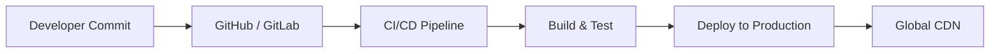

# 🌐 Comprehensive Web Design & Development Guide
> A complete, modern guide to Web Design, UI/UX principles, Frontend & Backend Development, and Web Deployment best practices.

---

## 📌 Table of Contents
1. [Overview](#-overview)
2. [UI/UX Design Principles](#-uiux-design-principles)
    - [Visual Hierarchy & Layout](#1-visual-hierarchy--layout)
    - [Typography & Color Theory](#2-typography--color-theory)
    - [Responsive & Mobile-First Design](#3-responsive--mobile-first-design)
    - [Accessibility (WCAG)](#4-accessibility-wcag)
3. [Frontend Development Roadmap](#-frontend-development-roadmap)
    - [Core Web Technologies](#1-core-web-technologies)
    - [CSS Frameworks & Preprocessors](#2-css-frameworks--preprocessors)
    - [JavaScript Frameworks](#3-javascript-frameworks)
4. [Backend & Database Architecture](#-backend--database-architecture)
    - [Architecture Patterns](#1-architecture-patterns)
    - [Database Management](#2-database-management)
5. [Web Performance Optimization (WPO)](#-web-performance-optimization-wpo)
6. [Web Security Best Practices](#-web-security-best-practices)
7. [Deployment & DevOps](#-deployment--devops)
8. [Recommended Tools & Resources](#-recommended-tools--resources)

---

## 📖 Overview
Web design encompasses many different skills and disciplines in the production and maintenance of websites. The different areas of web design include web graphic design, user interface design (UI design), user experience design (UX design), authoring (including standardized code and proprietary software), and search engine optimization (SEO).

This README provides a structural blueprint and standard operating procedure for designing and building production-grade web applications.

---

## 🎨 UI/UX Design Principles

### 1. Visual Hierarchy & Layout
- **F-Pattern & Z-Pattern**: Organize critical information along natural scanning paths. Use F-Pattern for text-heavy content and Z-Pattern for landing pages.
- **Grid Systems**: Utilize a 12-column grid layout for desktop and 4-column layout for mobile to maintain alignment and balance.
- **Whitespace (Negative Space)**: Use intentional padding and margins to reduce cognitive overload and group related elements.

### 2. Typography & Color Theory
- **Font Pairing**: Limit your interface to 2 font families (one for headings, one for body text).
- **Type Scale**: Establish a modular type scale (e.g., Major Third - ratio 1.25).
- **60-30-10 Color Rule**:
  - **60%**: Dominant/Neutral background color.
  - **30%**: Secondary color for structural elements and cards.
  - **10%**: Accent color reserved for Primary CTAs (Call to Actions) and key highlights.
- **Contrast Ratio**: Ensure a minimum contrast ratio of `4.5:1` for standard text and `3:1` for large text (WCAG AA Standard).

### 3. Responsive & Mobile-First Design
Always design for small screens first, then progressively enhance for larger viewports using media queries.

```css
/* Mobile-first base styles */
.container {
  width: 100%;
  padding: 16px;
}

/* Tablet Breakpoint */
@media (min-width: 768px) {
  .container {
    max-width: 720px;
    margin: 0 auto;
  }
}

/* Desktop Breakpoint */
@media (min-width: 1024px) {
  .container {
    max-width: 960px;
  }
}
```

### 4. Accessibility (WCAG)
- Use semantic HTML tags (`<header>`, `<nav>`, `<main>`, `<article>`, `<footer>`).
- Provide informative `alt` text for images.
- Ensure full keyboard navigation capability (`tabindex`, visible `:focus-visible` outlines).
- Use proper `aria-*` attributes for dynamic interactive components.

---

## 💻 Frontend Development Roadmap

### 1. Core Web Technologies
- **HTML5**: Semantic tags, Web Storage API (`localStorage`, `sessionStorage`), Forms & Validations.
- **CSS3**: Flexbox, CSS Grid, Custom Properties (CSS Variables), Animations & Transitions.
- **JavaScript (ES6+)**: Async/Await, Promises, DOM Manipulation, Modules, Fetch API, Event Loop.

### 2. CSS Frameworks & Preprocessors
| Tool | Category | Best Used For |
| :--- | :--- | :--- |
| **Tailwind CSS** | Utility-First CSS | Rapid UI development with low bundle size |
| **Sass / SCSS** | CSS Preprocessor | Managing complex CSS architectures with nesting & mixins |
| **Bootstrap / Bulma** | Component Library | Fast prototyping and standardized UI controls |

### 3. JavaScript Frameworks
- **React.js / Next.js**: Component-based UI development with Server-Side Rendering (SSR) & Static Site Generation (SSG).
- **Vue.js / Nuxt.js**: Progressive framework with reactive data binding and intuitive template syntax.
- **Svelte / SvelteKit**: Cybernetically enhanced web apps compiled to zero-dependency vanilla JS.

---

## 🗄️ Backend & Database Architecture

### 1. Architecture Patterns
- **RESTful APIs**: Standard HTTP methods (`GET`, `POST`, `PUT`, `DELETE`), stateless design, JSON payloads.
- **GraphQL**: Query language allowing clients to request exact data structures, eliminating over-fetching.
- **Microservices vs Monolith**: Choose Monolith for initial speed and simplicity; transition to Microservices when scaling team boundaries and domain isolation.

### 2. Database Management
- **Relational Databases (RDBMS)**: PostgreSQL, MySQL — best for structured data, ACID compliance, and complex joins.
- **NoSQL Databases**: MongoDB, Redis — ideal for dynamic schemas, unstructured content, high-throughput caching.

---

## 🚀 Web Performance Optimization (WPO)

- **Core Web Vitals**:
  - **LCP (Largest Contentful Paint)**: Keep under **2.5s**.
  - **INP (Interaction to Next Paint)**: Keep under **200ms**.
  - **CLS (Cumulative Layout Shift)**: Keep score below **0.1**.
- **Image Optimization**: Use modern formats (`.webp`, `.avif`), explicit `width`/`height` attributes, and `loading="lazy"`.
- **Code Splitting & Bundling**: Utilize Tree Shaking, Minification (Terser/Esbuild), and dynamic `import()` statement loading.
- **Caching Strategies**: HTTP Cache Headers (`Cache-Control`, `ETag`), Service Workers, CDN Caching (Cloudflare, Fastly).

---

## 🛡️ Web Security Best Practices

1. **HTTPS / TLS Encryption**: Always enforce SSL/TLS certificates and force HTTPS redirection.
2. **Sanitize Inputs & Prevent XSS**: Escape dynamic user inputs before rendering to the DOM.
3. **Cross-Site Request Forgery (CSRF)**: Use `SameSite=Strict` or `SameSite=Lax` cookies and CSRF tokens.
4. **Content Security Policy (CSP)**: Set strict CSP headers to restrict authorized sources for scripts, styles, and images.
5. **Rate Limiting**: Protect endpoints against Brute-Force and DDoS attacks using rate-limiting middleware.

---

## 🛠️ Deployment & DevOps



- **Hosting Platforms**:
  - **Vercel / Netlify**: Ideal for Frontend & Jamstack applications.
  - **AWS / GCP / DigitalOcean**: Scalable infrastructure for custom backends and containerized services (Docker / Kubernetes).
- **CI/CD Workflows**: Automate code linting, unit testing, and automated deployment using **GitHub Actions** or **GitLab CI**.

---

## 🧰 Recommended Tools & Resources

- **Design & Prototyping**: [Figma](https://figma.com), [Penpot](https://penpot.app)
- **Color Palettes**: [Coolors](https://coolors.co), [Adobe Color](https://color.adobe.com)
- **Typography**: [Google Fonts](https://fonts.google.com), [Fontshare](https://fontshare.com)
- **Icons & Graphics**: [Lucide Icons](https://lucide.dev), [Heroicons](https://heroicons.com), [Unsplash](https://unsplash.com)
- **Performance & SEO Testing**: [Google PageSpeed Insights](https://pagespeed.web.dev/), [Lighthouse](https://developer.chrome.com/docs/lighthouse/)
- **Documentation & Standards**: [MDN Web Docs](https://developer.mozilla.org), [web.dev](https://web.dev)

---
*Created with ❤️ for web developers, designers, and engineers.*
